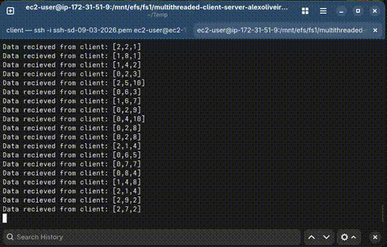
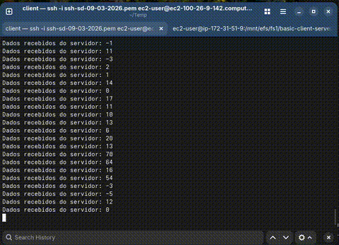

## Testes single threaded:

Requisições | Single Threaded (Serv+Clien) | Multitreaded (Serv+Client) | Multithreaded (Serv) |
-|-|-|-|
100_000 | 77.8804s | 78.1447s | |
10_000 | 7.0706s | 5.1915s | |
1_000 | 0.6868s | 1.3289s | | 

## Conclusão

Apesar do multithreading rodar mais rapido inicialmente,
quando o numero de requisições aumenta muito o servidor e o cliente
começam a mandar/receber requisições mais lentamente. Provavelmente
isso é causado por overhead de uso de uma thread por requisição;
Já o single threaded segue no mesmo ritmo do começo ao fim.

